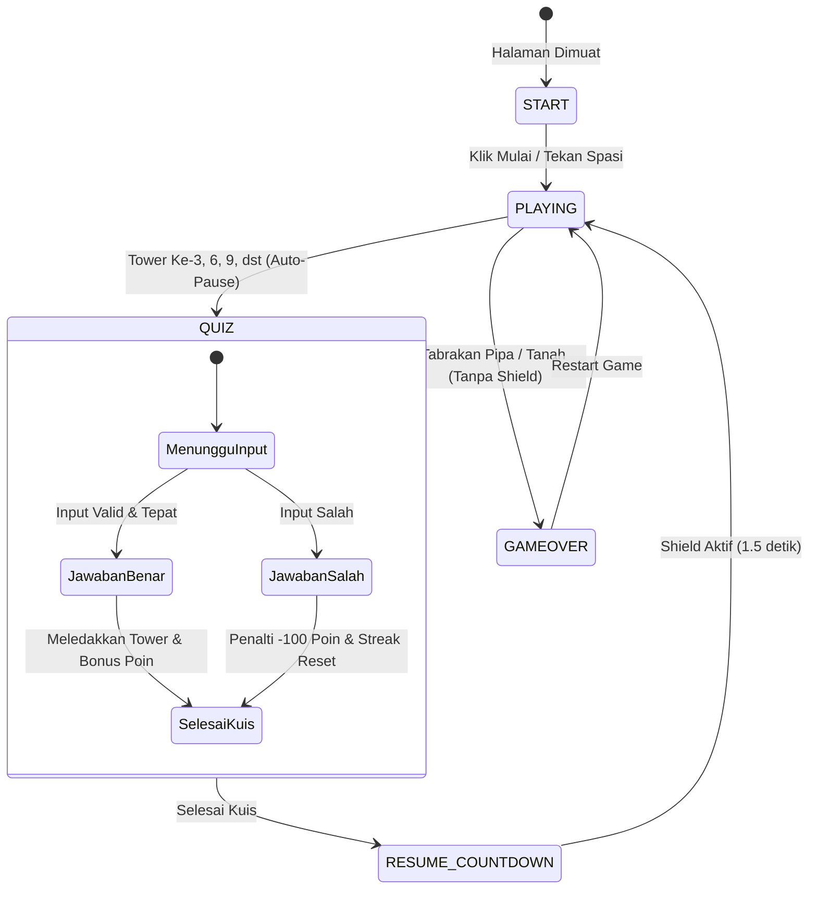

# 🏛 Arsitektur & Spesifikasi Teknis Flappy Math

Dokumen ini menjelaskan detail teknis internal, diagram alur sistem (*Data Flow & State Machine*), serta siklus hidup perulangan grafis (*Game Loop*) pada **Flappy Math**.

---

## 1. Diagram State Machine



---

## 2. Struktur Data & Variabel Kunci

### State Permainan (`game.js`)
- `gameState`: `'START'` | `'PLAYING'` | `'QUIZ'` | `'RESUME_COUNTDOWN'` | `'GAMEOVER'`
- `score`: Akumulasi skor pemain.
- `streak`: Jumlah kuis yang dijawab benar berturut-turut.
- `maxStreak`: Rekor streak tertinggi dalam 1 sesi bermain.
- `towersPassed`: Jumlah pipa yang berhasil dilewati.
- `totalQuizzes` & `correctQuizzes`: Statistik untuk menghitung persentase akurasi jawaban di layar Game Over.
- `shieldTimer`: Countdown sisa durasi kekebalan tubuh burung pasca kuis.

### Entitas Fisika Burung (`bird`)
```javascript
{
  x: 80,               // Posisi X tetap di viewport
  y: 250,              // Posisi Y dinamis
  radius: 17,          // Radius rendering visual burung
  hitboxRadius: 10,    // Radius kalkulasi tabrakan (sangat toleran)
  velocity: 0,         // Kecepatan vertikal saat ini
  gravity: 0.16,       // Akselerasi gravitasi per frame
  jumpForce: -4.5,     // Gaya dorong lompatan
  maxFallSpeed: 3.8,   // Batas kecepatan jatuh maksimum
  rotation: 0,         // Sudut kemiringan badan burung
  wingAngle: 0         // Sudut animasi kepakan sayap
}
```

### Entitas Rintangan (`towers`)
Array berisi objek rintangan:
```javascript
{
  x: 500,              // Posisi horizontal
  topHeight: 120,      // Tinggi pipa atas
  gap: 220,            // Jarak celah antara pipa atas dan pipa bawah
  passed: false,       // Flag apakah sudah melewati burung
  id: 1                // Nomor urut tower
}
```

---

## 3. Alur Render & Update Loop (`requestAnimationFrame`)

1. **Clear Screen & Draw Sky:**
   - Membersihkan canvas dan menggambar latar belakang langit gradasi biru.
   - Menggambar awan yang bergerak lambat horizontal (`clouds`).
   - Menggambar siluet pemandangan kota/pegunungan latar belakang (*background parallax*).
2. **Update & Draw Towers:**
   - Menggeser koordinat `x` tower ke kiri sebesar `currentSpeed`.
   - Menggambar pipa hijau klasik dengan bibir pipa, highlight pencahayaan, dan garis batas tegas.
   - Memeriksa batas lintasan burung untuk menambah `score` dan `towersPassed`.
   - Memicu transisi ke mode `QUIZ` jika `towersPassed % 3 === 0` pada tower yang baru dilewati.
3. **Update & Draw Bird:**
   - Mengaplikasikan gravitasi `bird.velocity += bird.gravity` (dibatasi `maxFallSpeed`).
   - Menggambar badan kuning burung, mata kartun besar, paruh oranye, sayap mengepak, dan ekor.
   - Menggambar efek *Neon Energy Shield* melingkar berdenyut jika `shieldTimer > 0`.
4. **Collision Detection:**
   - Memeriksa batas bawah (tanah) dan tabrakan lingkaran burung terhadap kotak pipa (*AABB vs Circle Collision*).
   - Ditolak jika `shieldTimer > 0` (kebal tabrakan).
5. **Draw Ground & Grass:**
   - Menggambar permukaan tanah bergulir (*scrolling ground*) di layer teratas sebelum partikel.
6. **Update & Draw Particles / Floating Floating Texts:**
   - Meledakkan kepingan partikel warna-warni saat kuis benar.
   - Menampilkan angka apung melayang (misal `+250 Poin`, `-100 Poin`, `COMBO x3`).

---

## 4. Logika Generator Matematika (`math.js`)

Matematika diatur secara deterministik dengan batas angka yang ramah hitungan cepat:
- **Penjumlahan (`+`):** Skala rentang 1 hingga 100 bertahap berdasarkan `towersPassed`.
- **Pengurangan (`-`):** Selalu menghasilkan nilai positif (`num1 > num2`).
- **Perkalian (`*`):** Faktor angka 2 s/d 12 dengan batas total perkalian ≤ 50 agar mudah dihitung mental.
- **Pembagian (`/`):** Dirancang terbalik dari perkalian bilangan bulat sehingga hasil bagi selalu bilangan bulat positif tanpa desimal.
- **Pengecoh:** Pilihan ganda acak dibuat di sekitar jawaban yang benar (contoh jika jawaban `24`, opsi pengecoh: `23`, `25`, `34`).

---

## 5. Sintesis Audio (`audio.js`)

Murni menggunakan Web Audio API tanpa file audio MP3/WAV eksternal:
- **Tone Generators:** Menggunakan `OscillatorNode` jenis `triangle` untuk nada melodi melayang, `square` untuk bass chiptune arcade, dan `sine` untuk efek suara lembut.
- **Audio Envelope:** Menggunakan `GainNode` dengan `setValueAtTime` dan `exponentialRampToValueAtTime` untuk ADSR envelope instan (menghindari suara *clicking/popping*).
